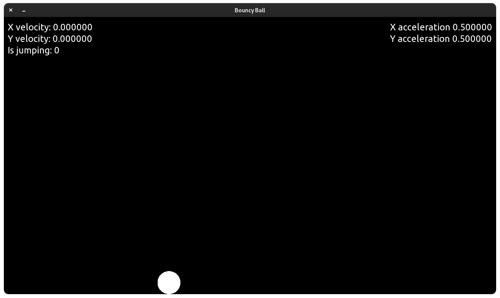

# Bouncy Ball

My first project done with C++ and the [SFML](https://www.sfml-dev.org/) library. It's quite simple, so if you tweak the numbers you'll encounter bugs in the physics. Here's a [video](https://youtu.be/meZCYtEhSE0) of it.

To compile it, [download](https://www.sfml-dev.org/download.php) and install SFML and compile the code with
```
g++ Main.cpp -o Main -lsfml-graphics -lsfml-system -lsfml-window
```



<hr>

## Controls
`A`: Move left

`D`: Move right

`Space`: Jump

`W`: Increase Y acceleration

`S`: Decrease Y acceleration

`Scroll Up/Down`: Increase/Decrease X acceleration